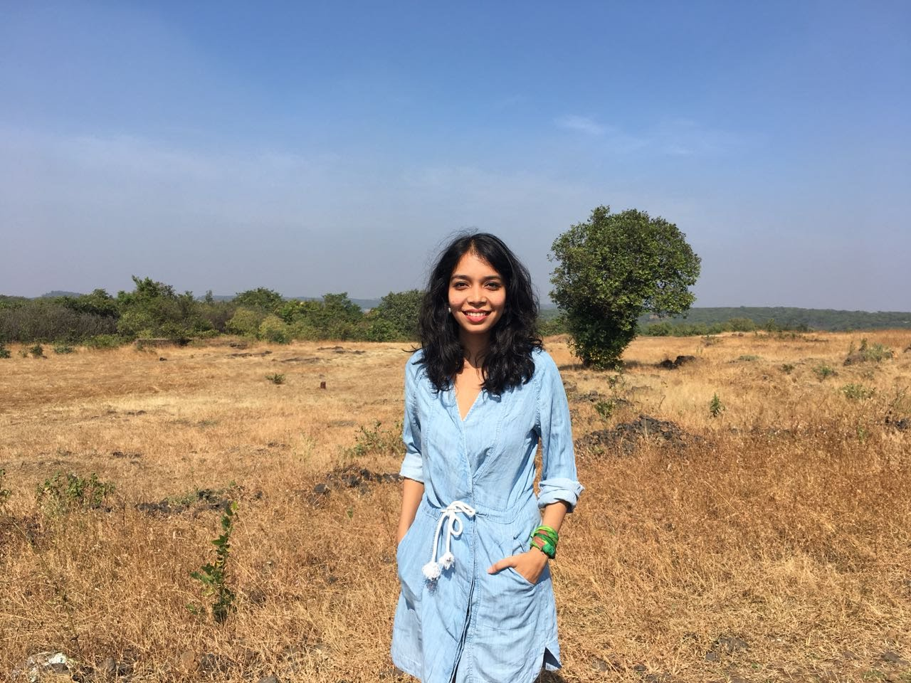

 

 

## Bio

I am a Postdoctoral Researcher at the [Kellogg School of Management](https://www.kellogg.northwestern.edu/) and the [Northwestern Institute on Complex Systems (NICO)](https://www.nico.northwestern.edu/), where I work with [Dr. Matt Groh](https://mattgroh.com/). 

My research examines how AI is reshaping the way people work and learn. Through large-scale behavioral experiments combined with computational and qualitative analysis, I pursue three interconnected goals:   (1) developing rigorous evaluation frameworks to assess when humans and AI form effective partnerships,   (2) designing interactions that support rather than atrophy human metacognition and skill development, and  
(3) understanding when and how AI can serve as a helpful companion and foster better human-human connection. 

I earned my PhD in Cognitive Science from the University of California, Irvine, where I was advised by [Dr. Mark Steyvers](https://steyvers.socsci.uci.edu/). I also hold a Master's degree in Statistics from UCI and got my B.Tech. in Materials Engineering from IIT Madras, India. 

You can find my [CV](CV.pdf) here and my publications on [Google scholar](https://scholar.google.com/citations?user=XFM1ItgAAAAJ&hl=en). 

Feel free to reach out to me for collaborations or any inquiries related to my research!

 
 

## Updates
Feb 2026: Our paper ['When large language models are reliable for judging empathic communication'](https://www.nature.com/articles/s42256-025-01169-6) is out in 
Nature Machine Intelligence!  

Nov 2025: I'm presenting my ongoing work on boosting people's empathic communication skills with LLM role playing games at the [CODE@MIT conference](https://ide.mit.edu/events/2025-conference-on-digital-experimentation-mit-codemit/).  
🎮 Try [_Lending an Ear_](https://human-ai-collaboration-lab.kellogg.northwestern.edu/rpg) to test your empathic communication skills!

Oct 2025: I gave a talk at the [DySoc Webinar at the University of Tennessee, Knoxville](https://calendar.utk.edu/event/dysoc-webinar-boosting-empathic-communication-skills-via-llm-role-playing-games).

Sept 2025: I gave a talk at the [Learn Behavioral Leadership Symposium in Chicago](https://learnbehavioral.com/).

May 2025: I gave a lightning talk at the [Northwestern Institute on Complex Systems (NICO)](https://www.nico.northwestern.edu/) seminar.

Feb 2025: I gave a talk at the [JTIP Symposium on Navigating Innovation, AI, and Access in a Transforming Legal Landscape](https://jtip.law.northwestern.edu/symposium/).

Jan 2025: Our paper investigating people's perceptions of LLM confidence is out in Nature Machine Intelligence! Check it out - [What large language models know and what people think they know]([https://arxiv.org/pdf/2401.13835.pdf](https://www.nature.com/articles/s42256-025-01169-6))

Aug 2024: I started a new position as a Postdoctoral Researcher at the [Kellogg School of Management](https://www.kellogg.northwestern.edu/) and the [Northwestern Institute on Complex Systems (NICO)](https://www.nico.northwestern.edu/)

Mar 2024: I defended my PhD thesis titled ['Human Mental Models of Self, Others, and AI Agents']()!

 
 
