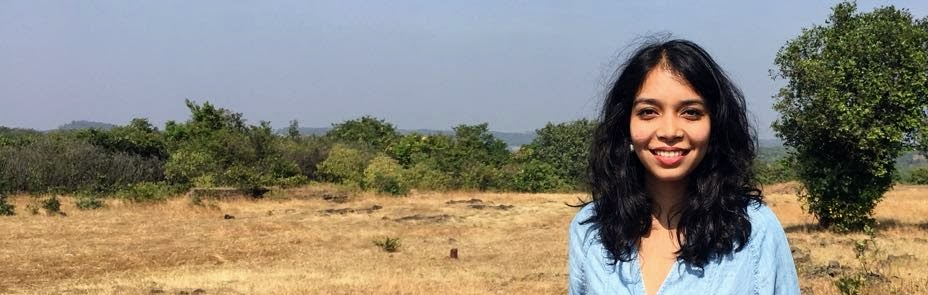

 

 

## About

I am a Ph.D. candidate in the Department of Cognitive Sciences at the University of California, Irvine where I work with [Dr. Mark Steyvers](https://steyvers.socsci.uci.edu/). My interests lie at the intersection of cognitive science and human-computer interaction. 

I model the cognitive mechanisms that are at play when people collaborate with AI agents. Using a combination of behavioral studies and computational modeling, my work examines how humans build mental models of other humans and of artificial agents. My work is supported by the Noyce Initiative in AI, Law, and Society.

I spent the summer of 2022 interning at [Honda Research Institute](https://usa.honda-ri.com/), where I was hosted by [Dr. Kumar Akash](https://scholar.google.com/citations?user=03uSPzAAAAAJ&hl=en). 

I also hold a Master's degree in Statistics from UCI. Before coming to UCI, I got my B.Tech. in Engineering from IIT Madras, India. 

## Updates

Nov 2022: Presented our work on AI-assisted Decision-Making at the Noyce Symposium, UCSB. 

Oct 2022: Our paper ['AI-assisted decision-making: A cognitive modeling approach to infer latent reliance strategies
'](https://link.springer.com/article/10.1007/s42113-022-00157-y) was published in [Computational Brain & Behavior](https://www.springer.com/journal/42113)

Oct 2022: Our paper ['Comparing models of learning and relearning in large-scale cognitive training data sets'](https://www.nature.com/articles/s41539-022-00142-x) was published in [NPJ Science of Learning](https://www.nature.com/npjscilearn/)

Jun 2022: Started my internship at [Honda Research Insititute](https://usa.honda-ri.com/) in San Jose as a Human Behavior Modeling Intern

Mar 2022: Our paper 'An Empirical Investigation of Reliance on AI-Assistance in a Noisy-Image Classification Task' was accepted for publication as a full paper at [HHAI 2022](https://www.hhai-conference.org/)

Dec 2021:  Awarded a fellowship by the [Irvine Initiative in AI, Law, and Society](https://ucinoyce.org/) for 2022

Nov 2021:  Presented our work on [Metacognitive Bandits and Algorithm Aversion](https://escholarship.org/content/qt7xc470dt/qt7xc470dt.pdf) at Psychonomics 2021

 
 
