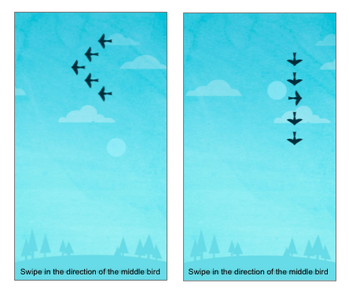
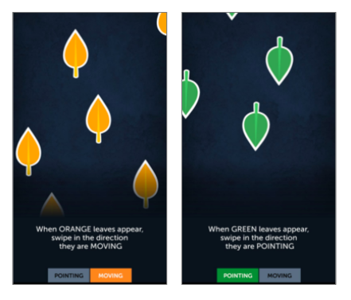

 

Screenshots of the two cognitive games in this research: Lost in Migration
(flanker task) and Ebb and Flow (task switching)

Practice in real-world settings exhibits many idiosyncracies of scheduling and duration 
that can only roughly approximated by laboratory research. In this paper, we investigate 39,157 
individuals’ performance on two cognitive games on the Lumosity platform over a span of 
five years. The large-scale nature of the data allows us to observe highly varied lengths of 
uncontrolled interruptions to practice and offers a unique view of learning in naturalistic 
settings. 
