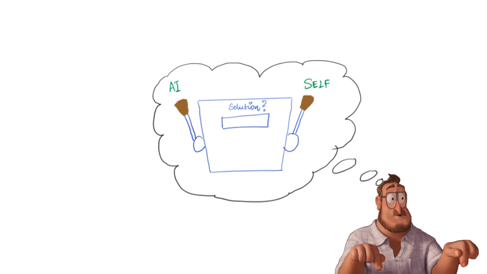

Human decision-makers are increasingly reliant on AI assistance in domains that were previously thought to be exclusively dependent on human subjectivity and expertise. A common pitfall of such hybrid human-AI decision making is the ineffective treatment of advice from an AI agent by the human. To correctly assess and use an AI agent's advice, the human must infer the agent's expertise and knowledge about the task at hand, i.e, the human must employ  machine theory of mind to build a mental model of the AI's ability. In this paper, we present a cognitive science perspective on how humans infer an AI agent's ability and use this inference to guide their decision to solicit the AI's advice as opposed to relying on their own judgement.

In this paper, we present a cognitive model for human-AI collaboration: we argue that varying degree of reliance on AI is a consequence of quasi-optimal decision-making on the part of the human. The human's decision to ask for help can be thought of as a metacognitive exercise - the human reflects on their own knowledge relative to the AI to make a decision on whether to seek help or not. This decision to ask for help can be formulated as a combination of two cognitive processes: _explore/exploit sequential decision-making_ and _metacognition_. We start with an assumption that humans behave like quasi-ideal observers, performing Bayesian inference to decide when to ask for AI assistance. We posit that humans engage metacognition to infer and compare the utility of making one's own decision with the utility of seeking the advice of an AI. This relative assessment guides the decision to seek advice of the AI or rely on their own judgement. We model the sequential decision-making problem of soliciting advice on each trial as an explore/exploit problem. The human can explore by choosing to solicit the advice of the AI. This action is risky, since the AI has an unknown capability and the action to solicit advice is associated with time costs associated with soliciting, processing, and integrating the advice with one’s own judgment. The decision to seek advice pays off if the utility of AI advice exceeds the utility of making an independent decision. The AI's expertise can only be inferred by soliciting its advice. The human can exploit by choosing to go ahead with an independent judgment. This choice is less risky when confidence in one’s decision is high. However, when the AI's advice is not solicited, the human doesn't learn about the AI's ability. To appropriately judge relative expertise, it is necessary for the human to solicit the AI's help and make a mental model of the AI's ability. 

