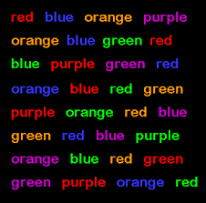

A basic question facing researchers in cognitive control is whether inhibition is a
unified phenomenon or a disparate set of phenomena. A natural way of addressing this
question is to study the pattern of individual differences across several inhibition tasks. In
this paper, we have explored whether correlations across inhibition tasks may be recovered.
We consider typically large studies that enroll hundreds of participants. The answer is
negative—correlations are difficult to recover with the accuracy that would allow for a
definitive answer to this basic question. This statement of poor recovery holds for
hierarchical models that are extended to the trial level. 

  

 
Why this depressing state-of-affairs occurs is fairly straightforward. Relative to trial
noise, there is little true individual variation in inhibition tasks. To see why this is so,
consider an average effect, say one that is 50 ms. In inhibition tasks like Stroop and flanker,
we can safely make a dominance assumption—nobody truly has a negative effect (Haaf &
Rouder, 2017). That is to say nobody truly identifies incongruent stimuli faster than congruent ones. 
Under this assumption, where all true scores are positive, a small mean
necessarily implies a small variance. For example, if true Stroop effects are reasonably
normally shaped and the mean is 50 ms and there can be no mass below zero, then an upper
bound on variability across true scores is a standard deviation of 25 ms or so. This is a small
amount of variation compared to trial variability, which is typically 7 times larger. This
small degree of variation necessarily implies a small degree of covariation across tasks. This
small degree of covariation is beyond the resolution of our experimental designs, and that is
why our studies fail.
 
We believe this problem of localizing individual differences and correlations extends
beyond inhibition tasks. It likely holds broadly in most task domains as most tasks have
relatively small effects, whether on the order of 50 ms for RT, on the order of .08 for
accuracy, or maybe on the order of 1/10th of the scale for Likert values. If we make a
dominance assumption—each individual has a true effect in the same direction—then there
cannot be much individual variability else these mean effects would be larger. And
measuring correlations with small degrees of individual variability may be beyond the
resolution of typical designs.
