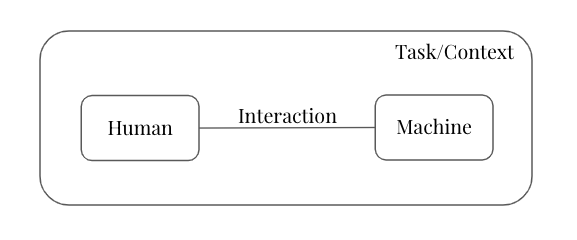

> > Ginny!" said Mr. Weasley, flabbergasted. "Haven't I taught you anything? What have I always told you? Never trust anything that can think for itself if you can't see where it keeps its brain?" - J.K. Rowling, Harry Potter and the Chamber of Secrets

In this [paper](trust_paper.pdf), I review work on human-machine interaction with a focus on understanding how and when humans trust machines. I use the terms machine, AI, algorithm, and decision aid interchangeably to describe a black-box model. 
 

I identify and summarize factors that may affect a human's trust in a machine. These factors can be categorized as relating to properties of the different components of this collaboration:(1)the human, (2)the machine, (3)the task or context in which the human and machine collaborate, and (4)the interaction between the human and the machine. The following figure shows the components of a typical human-machine collaboration setting.
 

  

 
The paper is organized as follows. I briefly review the different ways trust is defined across fields. I then review some popular models of trust between humans. Next, I move to a discussion of trust between humans, the different factors that affect human trust in machines, and some models of trust between humans and machines. I conclude with some thoughts on the possible research directions.
